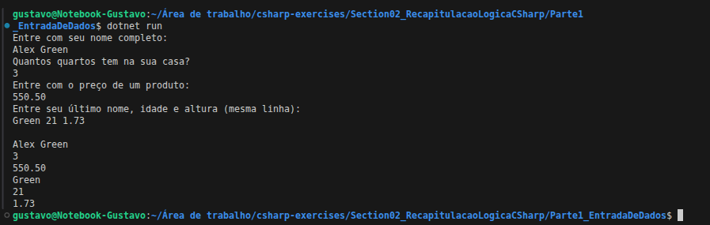

## Exercício: Entrada de dados em C#

Segundo exercício prático do curso. Aqui o foco foi ler dados digitados pelo usuário, converter para os tipos corretos e mostrar no console.

Usei nomes de variáveis em português propositalmente para reforçar meu entendimento da lógica.

### O que pratiquei:

* Ler dados com `Console.ReadLine()`
* Converter texto para número com `int.Parse()` e `double.Parse()`
* Ler vários dados na mesma linha usando `.Split(' ')`
* Formatar número com `InvariantCulture`
* Entender na prática a diferença entre usar `.` e `,` como separador decimal

---

### Enunciado


---

### Resultado no Terminal



---

<details>
<summary>Ver código</summary>

```csharp
using System;
using System.Globalization;

namespace EntradaDeDados
{
    class Program
    {
        static void Main(string[] args)
        {
            Console.WriteLine("Entre com seu nome completo:");
            string nomeCompleto = Console.ReadLine();

            Console.WriteLine("Quantos quartos tem na sua casa?");
            int quartos = int.Parse(Console.ReadLine());

            Console.WriteLine("Entre com o preço de um produto:");
            double preco = double.Parse(Console.ReadLine(), CultureInfo.InvariantCulture);

            Console.WriteLine("Entre seu último nome, idade e altura:");
            string[] vet = Console.ReadLine().Split(' ');

            string ultimoNome = vet[0];
            int idade = int.Parse(vet[1]);
            double altura = double.Parse(vet[2], CultureInfo.InvariantCulture);

            Console.WriteLine();

            Console.WriteLine(nomeCompleto);
            Console.WriteLine(quartos);
            Console.WriteLine(preco.ToString("F2", CultureInfo.InvariantCulture));
            Console.WriteLine(ultimoNome);
            Console.WriteLine(idade);
            Console.WriteLine(altura.ToString("F2", CultureInfo.InvariantCulture));
        }
    }
}
```

</details>