# 🔀 Exercícios: Estruturas Condicionais (if-else)


Diretório reservado para a resolução de 8 exercícios práticos do curso **[C# COMPLETO Programação Orientada a Objetos + Projetos](https://www.udemy.com/course/programacao-orientada-a-objetos-csharp/)**, ministrado por **Nelio Alves** na plataforma **Udemy**.

📌 **Foco:** Estruturas condicionais e regras de negócio.  
📊 **Progresso:** ✅ 8/8 concluídos.  

---

## 🛠️ Conhecimentos Desenvolvidos

* **Controle de Fluxo:** Domínio de estruturas condicionais encadeadas (`if`, `else if`, `else`).
* **Lógica e Matemática:** Aplicação de operadores lógicos (`&&`, `||`), operador de módulo (`%`) e cálculos progressivos.
* **Manipulação de Dados:** Leitura de múltiplas variáveis na mesma linha via `Console.ReadLine().Split()`.
* **Globalização:** Formatação profissional de valores monetários e decimais utilizando `CultureInfo.InvariantCulture`.

---

## 📋 Resumo dos Exercícios

| # | Desafio | Conceito Principal Aplicado |
|---|---|---|
| **01** | Número Negativo | `if/else` básico e validação de entrada |
| **02** | Par ou Ímpar | Operador de módulo (`%`) para paridade |
| **03** | Múltiplos | Operador lógico OU (`||`) e divisibilidade |
| **04** | Duração de Jogo | Lógica de tempo com ciclo de 24 horas |
| **05** | Lanchonete | Multiplicação de tipos mistos (`int` e `double`) |
| **06** | Intervalos | Validação de limites (`<=`, `>`) e encadeamento |
| **07** | Quadrantes | Plano cartesiano e operador lógico E (`&&`) |
| **08** | Imposto de Renda | Cálculo progressivo por faixas salariais |

---

## 💻 Soluções e Códigos

*(Clique nos títulos abaixo para exibir o enunciado, o código-fonte e o resultado no terminal)*

<details>
<summary><strong>Exercício 01: Número Negativo</strong></summary>

### 📷 Enunciado
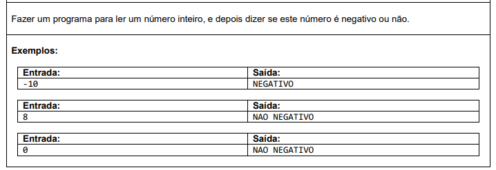

### 💻 Código
```csharp
namespace NegativeNumber {
    class Program {
        static void Main(string[] args) {
            int x = int.Parse(Console.ReadLine()!);
            
            if (x < 0) {
                Console.WriteLine("NEGATIVO");
            }
            else {
                Console.WriteLine("NAO NEGATIVO");
            }
        }
    }
}

```

### 🖥️ Saída no Terminal:
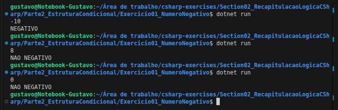

</details>

---

<details>
<summary><strong>Exercício 02: Par ou Ímpar</strong></summary>

### 📷 Enunciado:
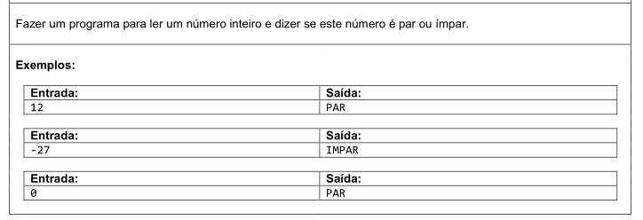

### 💻 Código:

```csharp
namespace EvenOrOdd {
    class Program {
        static void Main(string[] args) {
            int x = int.Parse(Console.ReadLine()!);
            
            if (x % 2 == 0) {
                Console.WriteLine("PAR");
            }
            else {
                Console.WriteLine("IMPAR");
            }
        }
    }
}

```

### 🖥️ Saída no Terminal:
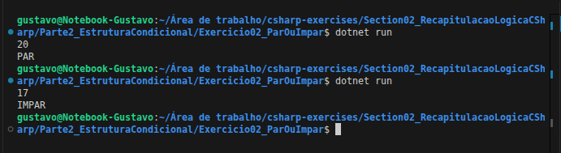

</details>

---

<details>
<summary><strong>Exercício 03: Múltiplos</strong></summary>

### 📷 Enunciado:
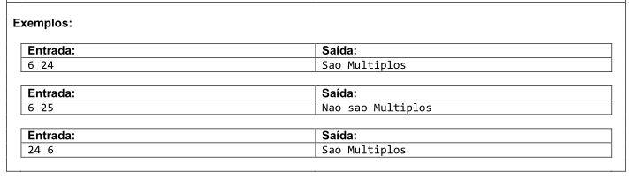

### 💻 Código:

```csharp
namespace MultipleNumbers {
    class Program {
        static void Main(string[] args) {
            string[] valores = Console.ReadLine()!.Split(' ');
            int x = int.Parse(valores[0]);
            int y = int.Parse(valores[1]);
            
            if (x % y == 0 || y % x == 0) {
                Console.WriteLine("Sao Multiplos");
            }
            else {
                Console.WriteLine("Nao sao Multiplos");
            }
        }
    }
}

```

### 🖥️ Saída no Terminal:


</details>

---

<details>
<summary><strong>Exercício 04: Duração de Jogo</strong></summary>

### 📷 Enunciado:
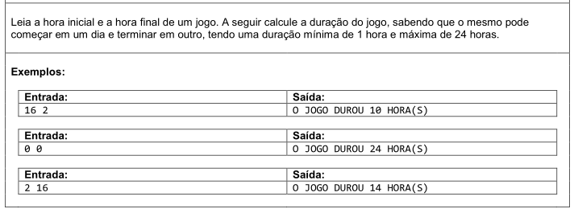

### 💻 Código:

```csharp
namespace GameDuration {
    class Program {
        static void Main(string[] args) {
            string[] valores = Console.ReadLine()!.Split(' ');
            int horaInicial = int.Parse(valores[0]);
            int horaFinal = int.Parse(valores[1]);
            
            int duracao;
            if (horaInicial < horaFinal) {
                duracao = horaFinal - horaInicial;
            }
            else {
                duracao = 24 - horaInicial + horaFinal;
            }
            
            Console.WriteLine("O JOGO DUROU " + duracao + " HORA(S)");
        }
    }
}

```

### 🖥️ Saída no Terminal:
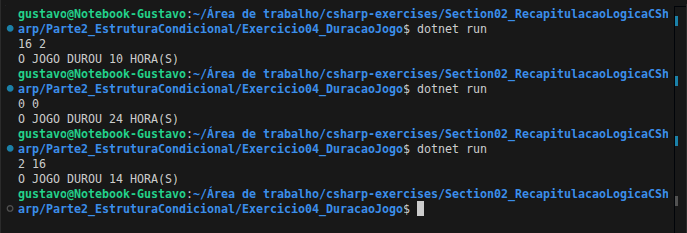

</details>

---

<details>
<summary><strong>Exercício 05: Lanchonete</strong></summary>

### 📷 Enunciado:
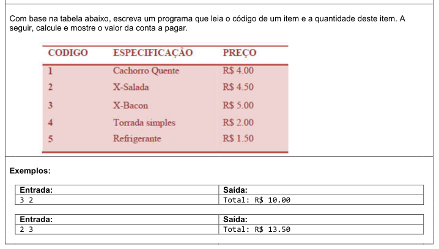

### 💻 Código:

```csharp
using System.Globalization;

namespace SnackBar {
    class Program {
        static void Main(string[] args) {
            string[] valores = Console.ReadLine()!.Split(' ');
            int codigo = int.Parse(valores[0]);
            int quantidade = int.Parse(valores[1]);
            
            double total;
            if (codigo == 1) {
                total = quantidade * 4.0;
            }
            else if (codigo == 2) {
                total = quantidade * 4.5;
            }
            else if (codigo == 3) {
                total = quantidade * 5.0;
            }
            else if (codigo == 4) {
                total = quantidade * 2.0;
            }
            else {
                total = quantidade * 1.5;
            }
            
            Console.WriteLine("Total: R$ " + total.ToString("F2", CultureInfo.InvariantCulture));
        }
    }
}

```

### 🖥️ Saída no Terminal:
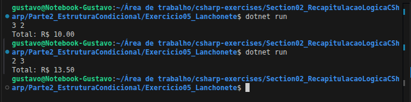

</details>

---

<details>
<summary><strong>Exercício 06: Intervalos</strong></summary>

### 📷 Enunciado:
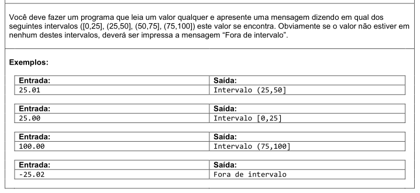

### 💻 Código:

```csharp
using System.Globalization;

namespace Intervals {
    class Program {
        static void Main(string[] args) {
            double numero = double.Parse(Console.ReadLine()!, CultureInfo.InvariantCulture);
            
            if (numero < 0.0 || numero > 100.0) {
                Console.WriteLine("Fora de intervalo");
            }
            else if (numero <= 25.0) {
                Console.WriteLine("Intervalo [0,25]");
            }
            else if (numero <= 50.0) {
                Console.WriteLine("Intervalo (25,50]");
            }
            else if (numero <= 75.0) {
                Console.WriteLine("Intervalo (50,75]");
            }
            else {
                Console.WriteLine("Intervalo (75,100]");
            }
        }
    }
}

```

### 🖥️ Saída no Terminal:
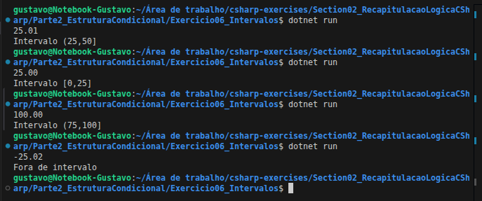

</details>

---

<details>
<summary><strong>Exercício 07: Quadrantes</strong></summary>

### 📷 Enunciado:
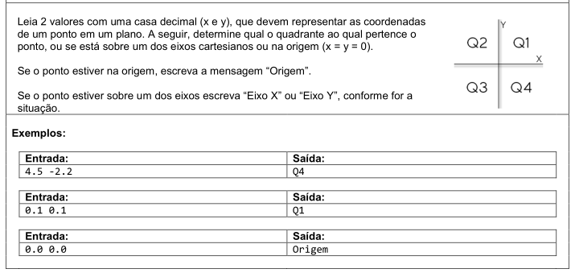

### 💻 Código:

```csharp
using System.Globalization;

namespace Quadrants {
    class Program {
        static void Main(string[] args) {
            string[] valores = Console.ReadLine()!.Split(' ');
            double x = double.Parse(valores[0], CultureInfo.InvariantCulture);
            double y = double.Parse(valores[1], CultureInfo.InvariantCulture);
            
            if (x == 0.0 && y == 0.0) {
                Console.WriteLine("Origem");
            }
            else if (x == 0.0) {
                Console.WriteLine("Eixo Y");
            }
            else if (y == 0.0) {
                Console.WriteLine("Eixo X");
            }
            else if (x > 0.0 && y > 0.0) {
                Console.WriteLine("Q1");
            }
            else if (x < 0.0 && y > 0.0) {
                Console.WriteLine("Q2");
            }
            else if (x < 0.0 && y < 0.0) {
                Console.WriteLine("Q3");
            }
            else {
                Console.WriteLine("Q4");
            }
        }
    }
}

```

### 🖥️ Saída no Terminal:
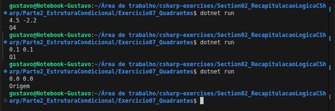

</details>

---

<details>
<summary><strong>Exercício 08: Imposto de Renda</strong></summary>

### 📷 Enunciado:
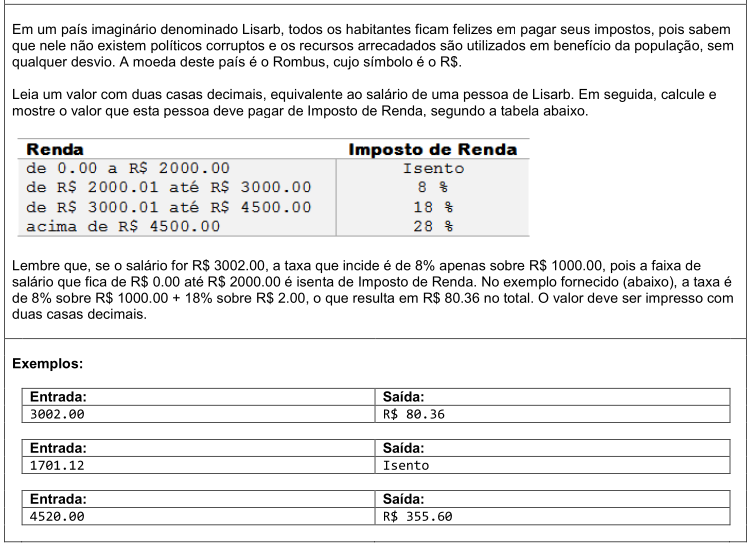

### 💻 Código:

```csharp
using System.Globalization;

namespace IncomeTax {
    class Program {
        static void Main(string[] args) {
            double salario = double.Parse(Console.ReadLine()!, CultureInfo.InvariantCulture);
            double imposto;
            
            if (salario <= 2000.0) {
                imposto = 0.0;
            }
            else if (salario <= 3000.0) {
                imposto = (salario - 2000.0) * 0.08;
            }
            else if (salario <= 4500.0) {
                imposto = (salario - 3000.0) * 0.18 + 1000.0 * 0.08;
            }
            else {
                imposto = (salario - 4500.0) * 0.28 + 1500.0 * 0.18 + 1000.0 * 0.08;
            }
            
            if (imposto == 0.0) {
                Console.WriteLine("Isento");
            }
            else {
                Console.WriteLine("R$ " + imposto.ToString("F2", CultureInfo.InvariantCulture));
            }
        }
    }
}

```

### 🖥️ Saída no Terminal:
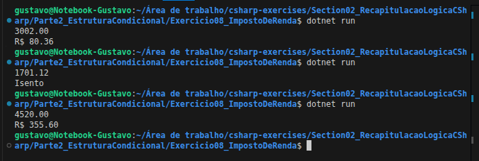
</details>

---