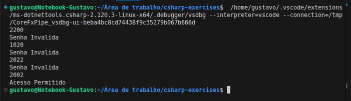
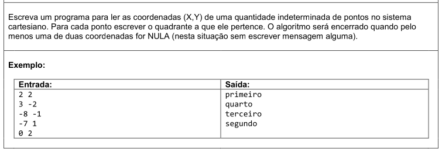
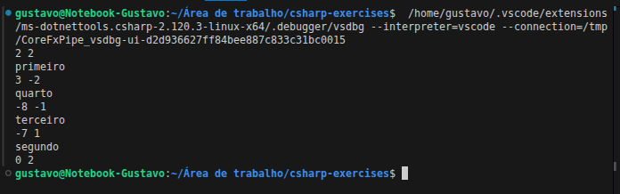
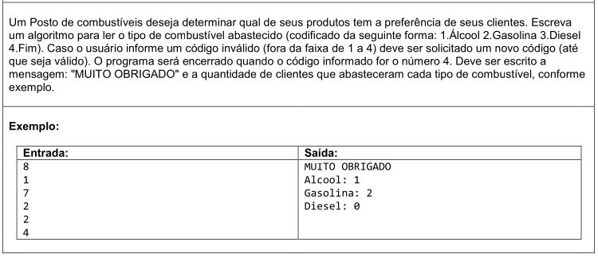
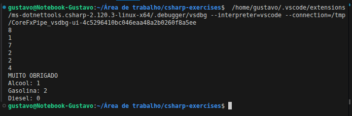

# 🔀 Exercícios: Estruturas Condicionais (while)


Diretório reservado para a resolução de 3 exercícios de lógica usando a estrutura de repetição `while`, do curso **[C# COMPLETO Programação Orientada a Objetos + Projetos](https://www.udemy.com/course/programacao-orientada-a-objetos-csharp/)**, ministrado pelo professor **Nelio Alves** na plataforma **Udemy**.

📌 **Foco:** Estruturas de repetição com quantidade indeterminada de passos.  
📊 **Progresso:** 🚧 3/3 concluídos.

---

## 🛠️ Conhecimentos Desenvolvidos

* **Controle de fluxo com `while`:** Aprendi na prática como manter um código rodando enquanto uma condição for verdadeira, principalmente para validar entradas e repetir processos.
* **Evitar loop infinito:** Percebi na marra como é importante atualizar as variáveis dentro do laço para o programa não ficar preso executando para sempre.
* **Condições de parada mais completas:** Usei operadores como `!=`, `&&` e `||` para criar regras mais próximas de situações reais.
* **Uso de contadores e acumuladores:** Trabalhei com variáveis que vão sendo incrementadas durante a execução — algo bem comum em sistemas que registram dados continuamente.

---

## 📋 Resumo dos Exercícios

| #      | Desafio      | O que foi praticado                                        |
| ------ | ------------ | ---------------------------------------------------------- |
| **01** | Senha Válida | Repetição com `while` até validar corretamente a entrada   |
| **02** | Coordenadas  | Uso de múltiplas condições (`&&`) e decisões com `if/else` |
| **03** | Posto de Combustível | Menu interativo com contadores para registrar escolhas |

---

## 💻 Soluções e Códigos

*(Clique nos títulos abaixo para exibir o enunciado, o código-fonte e o resultado no terminal)*

---

<details>
<summary><strong>Exercício 01: Senha Valida</strong></summary>

### 📷 Enunciado:


### 💻 Código:
```csharp
namespace Password {
    class Program {
        static void Main(string[] args) {

            int senha = int.Parse(Console.ReadLine()!);

            while (senha != 2002) {
                Console.WriteLine("Senha Invalida");
                senha = int.Parse(Console.ReadLine()!);
            }

            Console.WriteLine("Acesso Permitido");
        }
    }
}
```

### 🖥️ Saída no Terminal:


</details>

---

<details>
<summary><strong>Exercício 02: Coordenadas</strong></summary>

### 📷 Enunciado:


### 💻 Código:
```csharp
namespace Coordinates {
    class Program {
        static void Main(string[] args) {

            string[] valores = Console.ReadLine()!.Split(' ');
            int x = int.Parse(valores[0]);
            int y = int.Parse(valores[1]);

            while (x != 0 && y != 0) {
                if (x > 0 && y > 0) {
                    Console.WriteLine("primeiro");
                }
                else if (x < 0 && y > 0) {
                    Console.WriteLine("segundo");
                }
                else if (x < 0 && y < 0) {
                    Console.WriteLine("terceiro");
                }
                else {
                    Console.WriteLine("quarto");
                }
                valores = Console.ReadLine()!.Split(' ');
                x = int.Parse(valores[0]);
                y = int.Parse(valores[1]);
            }
        }
    }
}
```

### 🖥️ Saída no Terminal:


</details>

---

<details>
<summary><strong>Exercício 03: Posto de Combustível</strong></summary>

### 📷 Enunciado:


### 💻 Código:
```csharp
namespace GasStation {
    class Program {
        static void Main(string[] args) {

            int alcool = 0;
            int gasolina = 0;
            int diesel = 0;

            int tipo = int.Parse(Console.ReadLine()!);

            while (tipo != 4) {
                if (tipo == 1) {
                    alcool++;
                }
                else if (tipo == 2) {
                    gasolina++;
                }
                else if (tipo == 3) {
                    diesel++;
                }

                tipo = int.Parse(Console.ReadLine()!);
            }

            Console.WriteLine("MUITO OBRIGADO");
            Console.WriteLine("Alcool: " + alcool);
            Console.WriteLine("Gasolina: " + gasolina);
            Console.WriteLine("Diesel: " + diesel);
        }
    }
}
```

### 🖥️ Saída no Terminal:


</details>